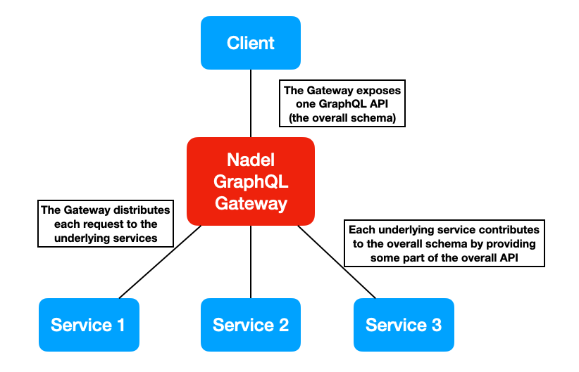

# Nadel: A distributed GraphQL engine

Nadel is a Kotlin library to combine several GraphQL services together. This is achieved by combining several underlying
GraphQL services (schemas) into one schema (overall schema).

The main purpose of this library is to power a GraphQL gateway which serves as the entry point for executing requests
across different services while presenting one GraphQL API.



## Features

- Compatible with Java codebases.
- Directive based approach. Existing GraphQL tooling will continue to work.
- Flexible GraphQL transform API. Modify fields and service call responses programmatically using the API.
- Explicit overall schema design: if a schema member is not declared in the `.nadel` file it is not exposed.
- Hydration: resolves references to other objects by calling other services.
- Batching: hydration calls can be automatically batched with a configurable max batch size per call.
- Field rename: fields can be given new names in the context of the exposed schema.
- Type rename: types can be given new names in the context of the exposed schema.
- Dynamic service resolution: _ability to_ programmatically decide which service is called for a top level field.

## Example

Let's assume we have two services: "Issues" and "Users". One has exposes issues and one has users. An `Issue` has a
reference to its author `User`.

This is the schema for the Issues service:

```graphql
type Query {
    issues: [Issue]
}
type Issue {
    id: ID
    authorId: ID
}
```

And this is the Users service:

```graphql
type Query {
    users(ids: [ID]): [User]
}
type User {
    id: ID
    fullName: String
}
```

You can define a combined Nadel schema as follows.

```graphql
# In Issue.nadel
type Query {
    issues: [Issue]
}
type Issue {
    id: ID
    author: User @hydrated(
        # This fetches users in batches
        field: "users"
        arguments: [{ name: "ids" value: "$source.authorId" }]
        inputIdentifiedBy: [{ sourceId: "authorId" resultId: "id" }]
    )
}

# In User.nadel
type Query {
    users(ids: [ID]): [User]
}
type User {
    id: ID
    name: String @renamed(from: "fullName")
}
```

The result is a new GraphQL API which combines the two services in one and has the following schema:

```graphql
type Query {
    issues: [Issue]
    users(ids: [ID]): [User]
}
type Issue {
    id: ID
    authors: [User]
}
type User {
    id: ID
    name: String
}
``` 

The outside world does not know about the transformations applied by Nadel. It can simply query the data and Nadel will
handle the rest e.g. under the hood Nadel will invoke Users for `users` data if `Issue.author` is requested for.

You can visit
our [test fixtures folder](https://github.com/atlassian-labs/nadel/tree/master/test/src/test/resources/fixtures) for
many more examples.

# Dev setup

In order to run the tests from `EngineTests` in IntelliJ you need to have the KoTest plugin installed.

[Understanding Nadel](./docs/Primer.MD).
